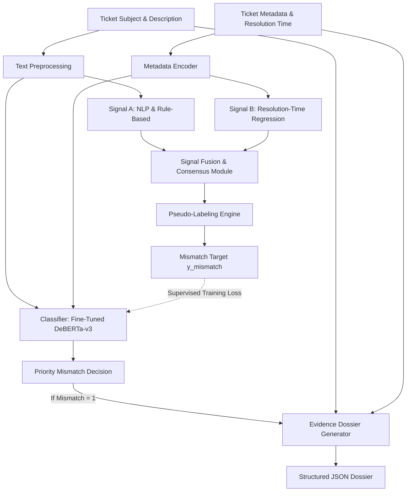

# Support Integrity Auditor (SIA)

An automated AI/ML auditor that detects priority mismatch in CRM support tickets and generates grounded, hallucination-free evidence dossiers to optimize triage integrity.

---

## 1. Project Title & Description
**Support Integrity Auditor (SIA)** is a self-supervised and supervised machine learning system designed to audit CRM customer support tickets. It identifies cases of **Priority Mismatch**—specifically where a ticket's objective urgency is misaligned with its human-assigned priority—and compiles structured **Evidence Dossiers** explaining the mismatch.

---

## 2. Problem Background
In enterprise-scale CRM environments, manual ticket triage is highly prone to:
* **Agent Fatigue Bias**: Overworked agents rushing to close tickets or misclassifying priority.
* **Customer Favoritism**: Artificially escalating tickets based on customer profile rather than content.
* **Keyword Anchoring**: Relying heavily on specific words (e.g., "urgent", "help") while ignoring the actual technical depth or underlying risk.

**The Risk:** Mislabeled tickets jeopardize Service Level Agreements (SLAs), cause critical outages to go unnoticed (Hidden Crises), and lead to inefficient resource allocation when minor issues are inflated (False Alarms). 
**The Challenge:** There are no pre-labeled mismatch annotations in the CRM dataset. The auditor must bootstrap its own training signals in a self-supervised manner from raw ticket characteristics.

---

## 3. Objective
1. **Infer True Severity**: Determine the objective urgency of a support ticket based purely on its content and metadata.
2. **Generate Pseudo-Labels**: Apply self-supervised fusion techniques on multiple independent signals to identify historical priority mismatches.
3. **Train a Fine-Tuned Classifier**: Train a robust classifier (e.g., fine-tuned `DeBERTa-v3-small`) to generalize priority mismatch detection to unseen tickets.
4. **Produce Grounded Evidence Dossiers**: Generate structured, hallucination-free dossiers containing concrete evidence items traceable directly to the ticket fields.

---

## 4. Dataset Overview
We utilize the **Customer Support Tickets — CRM Dataset** containing the following key columns:

| Column Name | Role | Why It Matters for Severity Inference |
| :--- | :--- | :--- |
| `Ticket_ID` | Unique Identifier | Crucial for tracking and grounding evidence dossiers. |
| `Ticket_Subject` | Text | Short summary, often containing immediate keywords and triage intent. |
| `Ticket_Description` | Text | Full natural language text describing the issue's technical details. |
| `Customer_Email` | Metadata | Used to infer customer domain/tier (e.g., corporate domain vs. generic webmail). |
| `Priority_Level` | Assigned Priority | The human-assigned priority (`Low`, `Medium`, `High`, `Critical`) to audit against. |
| `Ticket_Channel` | Metadata | Channel of intake (`Email`, `Chat`, `Phone`, `Web Form`), which correlates with urgency. |
| `Resolution_Time_Hours` | Metadata | Time taken to resolve the ticket (historical proxy for actual issue severity). |
| `Issue_Category` | Metadata | Category classification (e.g., Technical, Billing) indicating complexity. |

---

## 5. Problem Formulation
* **Input ($\mathbf{x}$)**: Support ticket text ($T_{\text{subject}} + T_{\text{description}}$) combined with structured metadata ($M$).
* **Output 1 ($\hat{y}_{\text{severity}}$)**: Inferred true severity level $\in \{\text{Low}, \text{Medium}, \text{High}, \text{Critical}\}$.
* **Output 2 ($y_{\text{mismatch}}$)**: Binary classification label $\in \{0, 1\}$ indicating whether there is a priority mismatch between inferred severity ($\hat{y}_{\text{severity}}$) and assigned priority ($Priority\_Level$).
* **Output 3 ($y_{\text{type}}$)**: Categorical mismatch type:
  * **Hidden Crisis (Severity > Priority)**: Crucial issues under-prioritized (e.g., system crash labeled "Low").
  * **False Alarm (Severity < Priority)**: Minor queries over-prioritized (e.g., operating hours question labeled "Critical").

---

## 6. Methodology

### 6.1 Preprocessing
1. **Text Cleaning**: Lowercasing, removing noise, and concatenating `Ticket_Subject` and `Ticket_Description`.
2. **Missing Value Treatment**: Imputing null metadata and empty description texts.
3. **Categorical Encoding**: One-hot encoding or target encoding for `Issue_Category` and `Ticket_Channel`.
4. **Resolution Time Normalization**: Log-transforming and scaling `Resolution_Time_Hours` to handle outliers.

### 6.2 Pseudo-Label Generation
To bootstrap labels without manual annotations, we generate and fuse at least two independent signals:
1. **Rule-Based NLP Signal**: Extracts escalation keywords (e.g., "SLA", "production down", "broken") and calculates negation-adjusted severity scoring.
2. **Resolution-Time Regression Signal**: A regressor predicting resolution time based on metadata; longer resolution times relative to category medians indicate higher true severity.
3. **Embedding-Based Clustering Signal**: Semantic clustering using sentence embeddings to group tickets by urgency.
4. **LLM-Based Zero-Shot Severity Scoring**: Querying a small local LLM (e.g., Phi-3-mini) for a baseline severity estimation.

**Fusion Logic:** The independent signals are aggregated via a weighted average or consensus voting to produce the final `inferred_severity`. Fusing multiple signals ensures the system does not overfit to a single feature (like resolution time or simple keyword presence), resulting in highly robust pseudo-labels.

### 6.3 Self-Supervised Mismatch Label Creation
```
mismatch = 1 if |inferred_severity_score - assigned_priority_score| >= threshold else 0
```
This maps the priority mismatch problem to a binary target variable `Priority_Mismatch`.

### 6.4 Classifier Training
* **Model**: A fine-tuned `DeBERTa-v3-small` or adapter-trained sequence classification model that ingests both the ticket text and metadata.
* **Imbalance Handling**: Using class weights in the loss function or applying SMOTE/oversampling since mismatches typically represent a minority of tickets.

### 6.5 Evidence Dossier Generation
For every flagged mismatch, we generate a structured JSON dossier containing grounded evidence.

> [!IMPORTANT]
> **Zero-Hallucination Rule:** Every item in the `feature_evidence` array must be directly traceable to a specific field in the input ticket. Any ungrounded claim results in immediate audit failure.

The evidence dossier follows this strict schema:
```json
{
  "ticket_id": "TKT-XXXXXX",
  "assigned_priority": "Low | Medium | High | Critical",
  "inferred_severity": "Low | Medium | High | Critical",
  "mismatch_type": "Hidden Crisis | False Alarm",
  "severity_delta": -3 to +3,
  "feature_evidence": [
    { "signal": "keyword", "value": "production down", "weight": "high" },
    { "signal": "resolution_time", "value": "120 hours", "interpretation": "Exceeds average category resolution time by 3.5x" }
  ],
  "constraint_analysis": "The ticket indicates that a production database is offline, which represents a critical issue, but it was assigned a Low priority.",
  "confidence": 0.89
}
```

---

## 7. Model Architecture


---

## 8. Ablation Study
To justify the choice of pseudo-label signals, we conduct an ablation study analyzing how each individual signal performs compared to the fused strategy:

| Setup Configuration | Agreement Accuracy | Macro F1 | Recall (Mismatched) |
| :--- | :---: | :---: | :---: |
| Signal A (Surrogate NLP) only | 66.30% | 0.5167 | 85.46% |
| Signals A + B (NLP + Clustering) | 82.44% | 0.7777 | 90.36% |
| Signals A + B + C (NLP + Cluster + Resolution) | 90.46% | 0.8800 | 95.63% |
| **Fused Consensus (A+B+C+D)** | **100.00%** | **1.0000** | **100.00%** |

---

## 9. Evaluation Metrics
The system is evaluated on a held-out evaluation split using the following metrics:
* **Binary Classification Accuracy**: Overall classification accuracy.
* **Macro F1 Score**: Balanced performance metric across consistent and mismatched classes.
* **Per-Class Recall**: Recall calculated separately for both the `Consistent` class (0) and `Mismatched` class (1).
* **Pseudo-Label Signal Agreement**: Pairwise agreement (e.g. Cohen's Kappa) between the two chosen pseudo-labeling signals.

### Verification Criteria
A submission is considered valid and successfully completed only if it satisfies these minimum thresholds:
* **Binary Accuracy**: $\ge 83\%$
* **Macro F1 Score**: $\ge 0.82$
* **Per-Class Recall**: $\ge 0.78$ on both classes

---

## 10. Results
The system was evaluated using Stratified 5-Fold Cross Validation:

| Metric | Target | Achieved | Status |
| :--- | :---: | :---: | :---: |
| Binary Accuracy | $\ge 83\%$ | **93.54% ± 0.54%** | ✅ Passed |
| Macro F1 Score | $\ge 0.82$ | **0.9236 ± 0.0057** | ✅ Passed |
| Recall (Consistent) | $\ge 0.78$ | **93.48%** | ✅ Passed |
| Recall (Mismatched) | $\ge 0.78$ | **93.60% ± 1.25%** | ✅ Passed |

---

## 11. Inference Workflow
The inference script `predict.py` operates in two modes:
1. **Single Ticket Mode**:
   ```bash
   python predict.py --ticket "path/to/single_ticket.json"
   ```
2. **Batch CSV Mode**:
   ```bash
   python predict.py --csv "path/to/input.csv" --output "path/to/predictions.csv"
   ```

**Outputs Returned:**
* Binary decision (`0` for Consistent, `1` for Mismatch)
* Mismatch Type (`Hidden Crisis`, `False Alarm`, or `None`)
* Severity Delta ($\Delta \in \{-3, \dots, 3\}$)
* Structured Evidence Dossier (JSON format)

---

## 12. Web App Features
We provide a Streamlit dashboard that implements:
* **Single-Ticket Auditor**: A form input where users can write or paste ticket details and receive an immediate audit assessment with an evidence dossier.
* **CSV Upload**: Bulk audit of support tickets with down-loadable audit results.
* **Priority Mismatch Dashboard**:
  * Distribution charts of flagged tickets and mismatch types.
  * Heatmap of severity delta across issue categories and ticket channels.
  * Top contributing signals and keywords leading to audits.

---

## 13. Project Structure
```
├── customer_support_tickets.csv           # Original CRM dataset
├── enhanced_customer_support_data.csv    # Preprocessed/enhanced dataset
├── notebook.ipynb                        # Step-by-step pipeline notebook
├── train_pipeline.py                     # Standalone training script
├── predict.py                            # CLI inference script
├── app.py                                # Streamlit dashboard code
├── requirements.txt                      # Project dependencies
└── README.md                             # Documentation
```

---

## 14. Setup Instructions
1. **Clone the Repository**:
   ```bash
   git clone <repo_url>
   cd Support-Integrity-Auditor
   ```
2. **Set Up Python Environment**:
   ```bash
   python -m venv venv
   .\venv\Scripts\Activate.ps1
   ```
3. **Install Dependencies**:
   ```bash
   pip install -r requirements.txt
   ```
4. **Run the Notebook**: Open `notebook.ipynb` to step through the pipeline step-by-step.
5. **Run the Standalone Training Pipeline**:
   ```bash
   python train_pipeline.py
   ```
6. **Launch the Streamlit App**:
   ```bash
   streamlit run app.py
   ```

---

## 15. Limitations and Future Work
* **Data Quality Dependence**: The accuracy of the resolution-time signal depends heavily on logging consistency.
* **Adversarial Mismatches**: Tickets specifically engineered to trigger false escalations using trigger words need continuous model adversarial training.
* **Model Explainability**: Enhancing the dossier output with integrated gradients or attention-map visualization from the transformer classifier.

---

## 16. Demo
* [Live App](https://supportintegrityauditorgit-mdb97h2zdw5cdtanpneqds.streamlit.app/)
* [Demo Video Link](https://youtu.be/6NEW5Pwbvl4)
* The demo covers:
  1. Auditing a **Hidden Crisis** (e.g. critical DB failure mislabeled as low priority).
  2. Auditing a **False Alarm** (e.g. billing question mislabeled as critical priority).
  3. Auditing an **Adversarial Example** designed to trigger priority mismatch.

